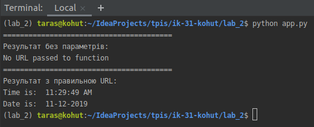

# Lab_2: Автоматизація. Знайомство з CI/CD.

1. Створюю папку `lab_2` з `README.md` файлом;
2. За допомогою пакетного менеджера `PIP` інсталюю `pipenv` та створюю ізольоване середовище для `Python`.
    
        pip install pipenv
        pipenv --python 3.7
        pipenv shell
        
3. Встановлюю бібліотеку `requests` у середовищі. Дана бібліотека дозволить створювати `HTTP` запити до заданих `Web` сторінок. Також встановлюю бібліотеку `ntplib` яка працює з часом.

        pipenv install requests
        pipenv install ntplib
        
4. Створюю файл `app.py`. Це буде програма яку потрібно протестити та запустити. Копіюю код програми із репозиторію `devops_course` до себе.
5. Переконюсь що програма працює правильно.

        python app.py

    
        
6. Встановлюю бібліотеку `pytest`. 
    
        pipenv install pytest
        
7. Приклади тестів знаходяться в окремій папці `tests`. Запускаю тести та переконуюсь що вони виконались успішно:

        pytest tests/tests.py

   
        
8. У програмі допиcую функцію яка буде перевіряти час доби AM/PM та відповідно друкувати: Доброго дня/ночі;
9. Пишу тест що буде перевіряти правильність виконання функції;
10. Для перенаправлення результатів використовую команди `>` та `>>`. Для того щоб перенаправити результати виконання тестів пишу `pytest tests/tests.py > results.txt`. Для того, щоб додати результат програми: `python app.py >> results.txt`.
11. Роблю коміт зі змінами до репозиторію.
12. Заповнюю Makefile та роблю коміт.