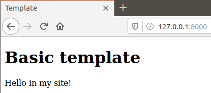

# Lab_4: Робота з Docker

1. Для перевірки чи докер встановлений і працює правильно на віртуальній машині запускаю перевірку версії, виведення допомоги та тестовий імедж:
   
        docker -v
        docker -h
        docker run docker/whalesay cowsay Docker is fun

    Перенаправляю вивід цих команд у файл `my_work.log` та роблю коміт із ним до репозиторію.
    
2. Для знайомства з Docker створюю імедж із Django сайтом зробленим у попередній роботі.

    * Оскільки проект на Python то і базовий імедж також потрібно вибрати відповідний. Всі імеджі можна знайти на Python Docker Hub. Використовую команду щоб завантажити базовий імедж з репозиторію:

          docker pull python:3.7-slim
          docker images
          docker inspect python:3.7-slim

    * Створюю файл з іменем `Dockerfile`, копіюю туди вміст такого ж файлу з репозиторію `devops_course`;

    * Ознайомлююсь із коментарями та структурою написання `Dockerfile`;

    * Замінюю посилання на власний Git репозиторій із веб-сайтом та роблю коміт даного `Dockerfile`.

3. Створюю власний репозиторій на `Docker Hub`. Для цього логінюсь у власний аккаунт на Docker Hub після чого переходжу у вкладку `Repositories` і далі натиснкаю кнопку `Create new repository`. Називаю його `lab4-examples`.
4. Виконую білд (`build`) Docker імеджа та завантажую його до репозиторію. Для цього вказую правильну назву репозиторію та `TAG`. Команда буде виглядати так (де `django` - це тег):
    
        docker build -t taras0101/lab4-examples:django .
        docker images
        docker push taras0101/lab4-examples:django
        
    [Посилання на Docker Hub репозиторій](https://hub.docker.com/repository/docker/taras0101/lab4-examples);
    
    Посилання на скачування імеджа: taras0101/lab4-examples:django;
 
5. Для запуску веб-сайту потрібно виконати команду:
   
       docker run -it --name=django --rm -p 8000:8000 taras0101/lab4-examples:django
   
    * переходжу на адресу http://127.0.0.1:8000 та переконуюсь що веб-сайт працює:
    
    
    
    
    
6. Оскільки веб-сайт готовий і працює, потрібно створити ще один контейнер із програмою моніторингу веб-сайту:

    * створюю ще один `Dockerfile` в якому поміщу програму моніторингу;

    * виконую білд даного імеджа та даю йому тег `monitoring`;

    * запускаю два контейнери одночасно (у різних вкладках) та переконуюсь що програма моніторингу успішно доступається до сторінок веб-сайту (використовую ключ `--net=host`):
    
        
    * для перенесення файла `server.log` з контейнера на машину використовую `Docker Volume -v`
    * роблю коміт файлу `Dockerfile.site` та результатів роботи програми моніторингу запущеної з `Docker` контейнера;

